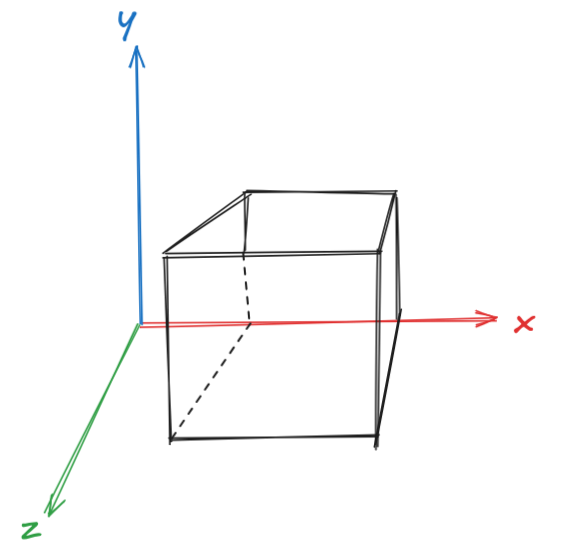

# Animasi Kubus 3D Di Terminal Menggunakan C by Ilkomerz Timothee Chalamet

Animasi kubus 3D yang dirender menggunakan karakter ASCII dalam terminal dan penerapan rumus matematikanya untuk mengimplementasikan dynamic lighting. Proyek ini terinspirasi dari 'Donut math: how donut.c works' (https://www.a1k0n.net/2011/07/20/donut-math.html)



## Fitur

- **Rotasi 3D Real-time:** Kubus berputar mulus di ketiga sumbu (X, Y, Z).
- **Proyeksi Perspektif**: Proyeksi 3D-ke-2D yang akurat dengan penskalaan perspektif.
- **Depth Buffering**: Implementasi Z-Buffer untuk memastikan keterlihatan semua sisi kubus.
- **Sistem Pencahayaan**: Kalkulasi luminasi berbasis dot product dengan pemetaan kecerahan.
- **Rendering Dengan Seni ASCII**: Karakter ASCII berbeda untuk setiap pencahayaan dan bayangan.
- **Terminal Rendering**: Dapat dijalankan dalam terminal manapun (ukuran dapat dimodifikasi)
- **Smooth Animation**: Kecepatan sekitar 60 FPS

## Quick Start

### Prerequisites
- GCC compiler
- POSIX-compliant terminal
- Linux/macOS (or Windows with WSL)

### Compilation

```bash
gcc main.c -lm -o spinning-cube
```

Flag `-lm` menautkan library matematika bawaan C (wajib digunakan untuk menjalankan fungsi trigonometri).

### Running

```bash
./spinning-cube
```

Tekan `Ctrl+C` untuk menghentikan animasi.

## Cara Kerja

### Algoritma

1. **Komputasi Rotasi Matriks**: Konversi titik 3D dengan sudut euler (A, B, C)
   - Sudut di-increment tiap frame
   - Nilai sin/cos yang di precomputed untuk efisiensi

2. **Proyeksi**: Proyeksi koordinat 3D ke ruang layar 2D
   - Menggunakan perspective division (1/Z scaling)
   - K1 dan K2 merupakan scaling constants untuk proper sizing

3. **Lighting**: Normal vector illumination
   - Dot product dengan arah cahaya untuk menentukan kecerahan
   - Memetakan intensitas cahaya menggunakan ASCII: `.,-~:;=!*#$@`

4. **Z-Buffering**: Menyimpan informasi kedalaman
   - Hanya merender permukaan terdekat tiap pixel
   - Memastikan tidak ada overlapping pada face artifacts

### 3D Transformasi

Kode ini melakukan:
- **Matriks Rotasi** untuk ketiga sumbu yang digabung menjadi satu
- **Vektor normal** juga dirotasikan untuk memastikan kebenaran lighting
- **Depth scaling** untuk menghasilkan efek perspektif

## Konsep Matematis

### Rumus Proyeksi
```
x_screen = (x_rotated / z_rotated) * K1 * 2 + WIDTH/2
y_screen = (y_rotated / z_rotated) * K1 + HEIGHT/2
```

### Luminasi (Lighting)
```
L = normal_x * light_x + normal_y * light_y + normal_z * light_z
```

### Transformasi Rotasi
Matriks rotasi 3D penuh yang menggabungkan perputaran sumbu X, Y, dan Z yang menggunakan nilai sin/cos yang sudah di komputasi sebelumnya.

## Konfigurasi

Anda juga bisa mengotak-atik `main.c` untuk menghasilkan animasi yang anda mau:

- `WIDTH` (160): Lebar Terminal dalam karakter
- `HEIGHT` (40): Tinggi Terminal dalam karakter
- `S` (30): Setengah panjang sisi kubus
- `STEP` (0.5): Kepadatan titik tiap sisinya (kecil = padat)
- `K1` (100), `K2` (250): Konstanta pembesar
- `A`, `B`, `C` increment values (lines 161-163): Kecepatan rotasi

## Technical Details

- **Language**: C
- **Dependencies**: Standard C library + math.h
- **Performance**: ~60 FPS on modern hardware
- **Memory**: ~66KB for buffers (160×40 = 6400 characters + 6400 floats)
- **Rendering Method**: Direct terminal manipulation with ANSI escape codes

## Customization Ideas

- Change rotation speeds for faster/slower animation
- Modify the cube size by adjusting `S`
- Experiment with different light directions
- Add different ASCII character sets for artistic effects
- Implement keyboard controls for interactive rotation

## References

- 3D Graphics Projection: Perspective transformation
- Z-Buffer Algorithm: Depth testing
- Lighting Models: Phong/Gouraud shading basics
- Terminal Graphics: ANSI escape codes

## Bobot Edukasi

Proyek ini mendemonstrasikan:
- Fundamental grafika komputer 3D
- Transformasi matriks dan aljabar linear
- Susunan kedalaman dan rendering pipelines
- Rotasi trigonometris
- Terminal/ASCII art programming

## License

Open for learning and modification.

---

**Created by**: Kemas Nayar  
**Animation Speed**: ~60 FPS  
**Build**: `gcc main.c -lm -o spinning-cube && ./spinning-cube`
